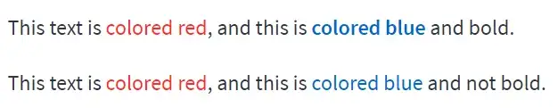


# Streamlit Text Gets Colourful

## Your Streamlit text no longer has to be boring. Version 1.16 lets you colour markdown text.


 on [Unsplash](https://unsplash.com)](./images/katzki.jfif)

*Photo by [Robert Katzki](https://unsplash.com/@ro_ka?) on [Unsplash](https://unsplash.com)*


You've been able to use coloured text in Streamlit Markdown strings for a long time but it has required using HTML embedded in the Markdown text.

And that can get a little clumsy:
```` Python
    st.markdown("The next word is <span style='color:red'>red</span>",
                 unsafe_allow_html=True)
````
All that just to make one word red.

Streamlit maintains that [embedding HTML in your text can be insecure](https://github.com/streamlit/streamlit/issues/152) which is why you have to set a special argument to allow it. The rest of the extra code is an HTML <span>tag. This tag is a container that does nothing but enables us to make changes to the style of the content and that's what we see in the code style='color:red'.

You can, of course, do much more with embedded HTML than just change the colour of text but that is the focus of this article.

Now, in version 1.16 of Streamlit, they have introduced some new syntax that lets you colour your text while avoiding the use of HTML. It's not as flexible as using HTML but it is definitely neater.
```` Python
    st.markdown("The next word is :red[red]")
````
That's a little more concise.

The syntax for specifying a colour for some text begins with a colon, the name of the colour, followed by the text enclosed in square brackets.
```` Python
    :*color*[*your text here*]
````
That's probably about as short as you could make it. But there are some peculiarities.

For example, the two methods are not exact equivalents. Let's look at some examples.

If you want to code along with me, don't forget to add this first:
```` Python
    import streamlit as st
````
Let's look at the code to display this.
```` Python

````
Using the new syntax we have this:
```` Python
    st.markdown("""This text is :red[colored red], 
                and this is **:blue[colored blue]** and bold.""")
    st.markdown("""This text is :red[colored red], 
                   and this is :blue[colored blue] and not bold.""")
````
The old HTML way would look like this:
```` Python
    st.markdown("""This text is <span style='color:red'>colored red</span>, 
                   and this is <b><span style='color:blue'>colored blue</span></b> and bold.""", 
                   unsafe_allow_html=True)
    st.markdown("""This text is <span style='color:red'>colored red</span>, 
                   and this is <span style='color:blue'>colored blue</span> and not bold.""", 
                   unsafe_allow_html=True)
````
I've used triple quotes so I can run the string over more than one line for readability.

That code gives us this:


Same thing, right? Actually not, but pretty similar. You'll be forgiven if you don't see any difference between the two images ' I've put them much too far apart for you to be able to notice-but they aren't quite the same colours.

Look at this:


Ok, there's not much in it but why are they different? Odd. Here's the code so you can see that they ought to be the same colours:
```` Python
    st.markdown("""**This text is :blue[blue], 
                                :green[green], 
                                :orange[orange], 
                                :red[red], 
                                :violet[violet] 
                                using Streamlit colors.**""")
    
    st.markdown("""**This text is <span style='color:blue'>blue</span>, 
                                <span style='color:green'>green</span>, 
                                <span style='color:orange'>orange</span>, 
                                <span style='color:red'>red</span>, 
                                <span style='color:violet'>violet</span> using HTML/CSS colors.**""", 
                                unsafe_allow_html=True)
````
There's another slight oddity. Only the colours blue, green, orange, red, and violet are supported by the new syntax. You would think, then, that specifying a different colour would cause an error. Let's see:
```` Python
    st.markdown("#### Using Streamlit coloring:")
    st.markdown("This text is :pink[colored pink], and this is **:violet[purple-colored]** and bold.")
    
    st.markdown("#### Using HTML/CSS coloring:")
    st.markdown("This text is <span style='color:pink'>colored pink</span>, and this is **<span style='color:violet'>purple-colored</span>** and bold.", unsafe_allow_html=True)
````
The result:


Now that's a strange result! No syntax or any other error but instead an odd, uncoloured result, that has new lines inserted around the (non-)coloured text.

So, what's the verdict on this new feature?

Get the syntax right and use the right colours, and you will get a very similar result to using HTML but with neater code and a lot less typing. All in all, then, a welcome addition. But catching those errors would have made it a better one.

As always, thanks for reading, I hope you've found it helpful. 

[This is a link to a Streamlit program that contains all of the code above.](https://raw.githubusercontent.com/alanjones2/streamlitfromscratch/main/code/md_color.py)

## [Back to _Streamlit from Scratch_](https://alanjones2.github.io/streamlitfromscratch/) 