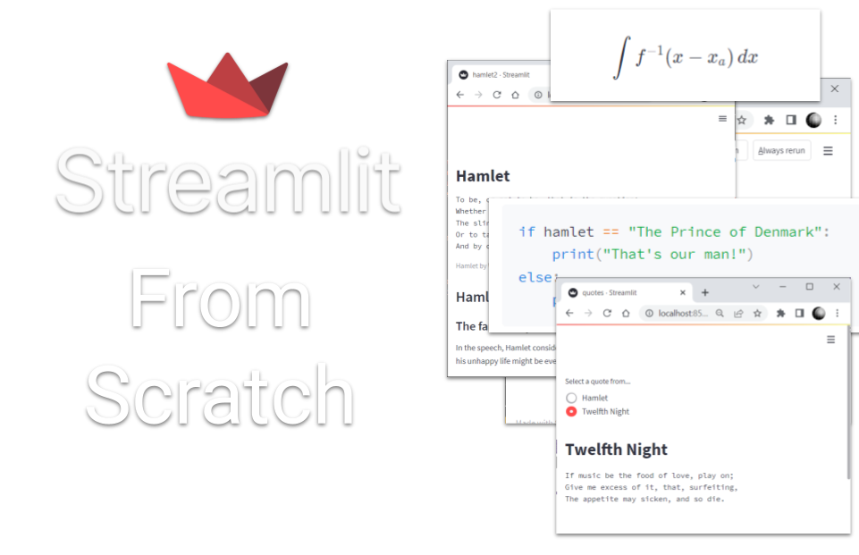
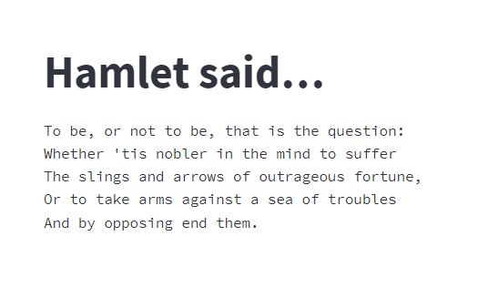

# An Introduction to Streamlit

<!---->




 Streamlit is a framework for creating simple and elegant web applications in pure Python. It's mainly aimed at Data Scientists and Analysts but can also be used as a general-purpose framework for creating web applications.
 
No knowledge of HTML or Javascript is needed. Indeed, you can create a simple web page with barely any knowledge of Python!

This is the first part of a series of tutorials in which we will discover how Streamlit can be used to create anything from a simple text-based web page to a sophisticated, interactive dashboard with data visualizations using the Plotly visualization library. 

First, we look at how to get started, which tools we need to download (there aren't many) and how to edit and run your first Streamlit app.

Here is the code for a simple web page that consists only of text:

```` Python
import streamlit as st

st.title("Hamlet said…")
st.text("""
To be, or not to be, that is the question:
Whether 'tis nobler in the mind to suffer
The slings and arrows of outrageous fortune,
Or to take arms against a sea of troubles
And by opposing end them.
""")
````

_Listing 1 - hamlet.py_

And it looks something like this:

<!---->


Not particularly exciting but it shows just how easy it is to produce a simple web page. 

_If you want to code along with this course (and, of course, you do!), you can copy any of the code blocks by placing your cursor over the block and then clicking on the button that will appear on the right._

In this series we will go quite a lot beyond this, though, creating web applications that are interactive and include data visualizations in Pandas, Plotly and more.

But first, we need to install the tools.

Select _Next_ to begin.