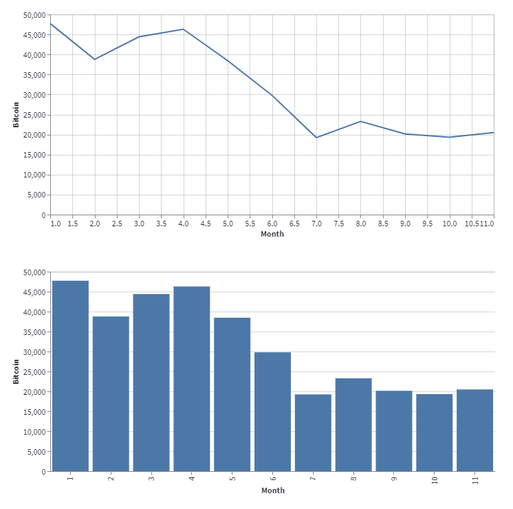
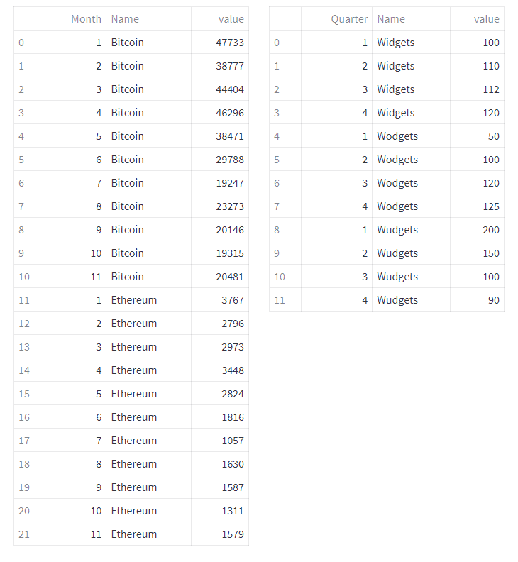
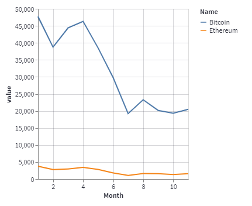

# Altair

As just mentioned, Altair charts are based on the Vega-Lite specification, so the graphics produced by Altair will be the same as Vega-Lite. And as we shall see, it is a declarative approach to constructing charts.

To plot an altair chart we first need to import the library:
```` Python
import altair as alt
````

We then define a chart and use ``st.altair_chart(c)`` (where ``c`` is the chart) to plot it.

The syntax to define an Altair chart is quite different to what we have so far encountered. We start by defining a chart object.
```` Python
c = alt.Chart(cryptodf)
````
This creates a chart from the dataframe ``cryptodf`` but it doesn't do much for us as it is. We now need to declare _marks_ and _encodings_.

_Marks_ are how the chart should be visualized, they may be lines, points, bars, etc. E.g.

```` Python
c = alt.Chart(cryptodf).mark_line()
````

The use of ``mark_line()`` means that we want to draw a line chart. There are several other marks, such as ``mark_bar()`` and ``mark_point()`` which will draw different types of chart.

Then to visually make sense of the data we can map various _encoding channels_ to columns in the dataset. 

We could encode the data column ``'Month'`` with the ``x`` channel, for example, which represents the x-axis position of the points. That gives us one axis. Then we could encode the column ``'Bitcoin'`` to ``y``.

```` Python
c = alt.Chart(cryptodf).mark_line().encode(
    x='Month:O', y='Bitcoin')
````

The strange ``:O`` in the code tells Altair that ``'Month'`` is an ordinal value and so it will be displayed as a list of integers (otherwise they would be displayed as real number and representing _January_ with the number 1.0 is a bit odd).

To draw the chart we call the ``st.altair_chart()`` method:

```` Python
st.altair_chart(c, use_container_width=True)
````
And this results in a neat line chart of the BTC value over the last 11 months.

You'd prefer a bar chart? Easy. Just substitute ``mark_line()`` with ``mark_bar()``.

Here are the two charts.

<!---->


## Re-visiting the data


This works well for charting a single column but if we wanted to have both BTC and ETH on the same graph, we need to manipulate the data a little - well quite a lot, really.

In terms of the crypto chart, we need to put both BTC and ETH values in the same column. But as we need to distinguish between them, we need another column that labels them _BTC_ or _ETH_.

Similarly, with the sales data, each value must be in the same column and this time we need a new column that labels the values as _Widget_, _Wodget_ or _Wudget_.

We can transform our current dataframes with the Pandas ``melt()`` method. Here is the code:

```` Python
cryptodf1 = pd.melt(cryptodf, 
              value_vars=['Bitcoin','Ethereum'], 
              id_vars=['Month'],
              var_name='Name'
              )
salesdf1 = pd.melt(salesdf, 
              value_vars=['Widgets','Wodgets','Wudgets'], 
              id_vars=['Quarter'],
              var_name='Name'
              )
````
Now we have two new dataframes that look like this:

<!---->



It’s the same data, but this format allows us to do more with the charting packages we will look at next.

## Back to Altair
Re-jigging the data like that means we can do this with Altair:

```` Python
c = alt.Chart(cryptodf1).mark_line().encode(
    x='Month', 
    y='value', 
    color = 'Name:N'
    )

st.altair_chart(c)
````
The y-axis is now mapped onto the _value_ column which contains thevalues for both BTC and ETH. But now we have a third encoding ``color`` which is mapped onto the _Name_ column. So we have two lines of different colours on the same chart.

<!---->


With this data format, we can group bar charts. In the image below we see the two cryptocurrencies compared by showing each bar side by side.


We achieve this by adding a new encoding column which is set to ‘Month’. this arranges the data for each month in ordered columns and plots the individual bars within those columns.

```` Python
c = alt.Chart(cryptodf1).mark_bar().encode(
  x='Name:O',
  y='value:Q',
  color = 'Name:N',
  column = 'Month:N')

st.altair_chart(c)
````

You can see that I have added new data types to the various encodings. Their meanings are as follows:

:O Ordinal, a discrete ordered quantity

:Q Quantitative a continuous real-valued quantity

:N Nominal, a discrete unordered category

Time to move on to Plotly.