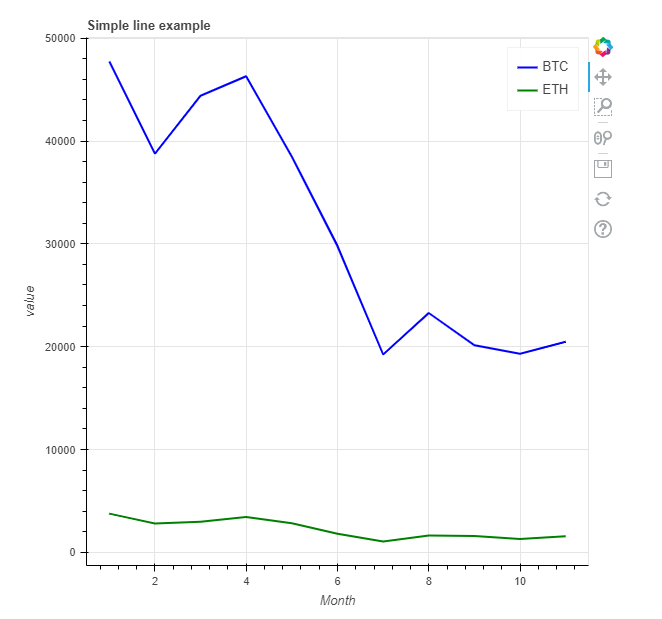
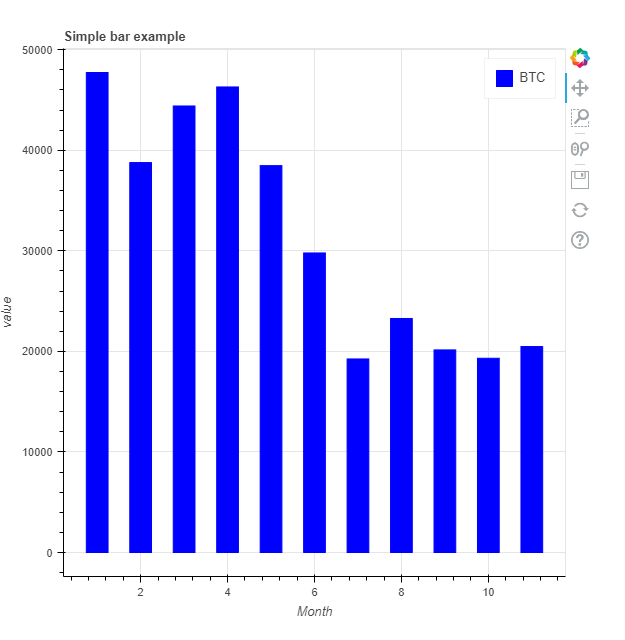

# Bokeh

Bokeh also lets you create interactive plots that you can pan across and zoom in on. It takes more code to produce a similar plot but the results are quite attractive. It can get fairly complex, though.


For our purposes, we import the library like this.
```` Python
from bokeh.plotting import figure
````
Here is our crypto line graph, again, Bokeh style.



The code you see below is comparatively long. We start by creating a Bokeh figure object with a title and labels for the axes. Then we add two lines to that object, specifying columns for the x and y data, a legend label and a colour. We also set the line width to 2.

```` Python
# create a new plot with a title and axis labels
p = figure(title="Simple line example", 
           x_axis_label="Month", 
           y_axis_label="value")

# add a line renderer with legend and line thickness
p.line(cryptodf['Month'], 
       cryptodf['Bitcoin'], 
       legend_label="BTC", 
       color = 'blue',
       line_width=2)
p.line(cryptodf['Month'], 
       cryptodf['Ethereum'], 
       legend_label="ETH", 
       color = "green",
       line_width=2)

st.bokeh_chart(p)
````
A bar chart for the BTC data looks like this.



It’s produced by this code.

```` Python
p = figure(title="Simple bar example", 
           x_axis_label="Month", 
           y_axis_label="value")

p.vbar(x=cryptodf['Month'], 
       top=cryptodf['Bitcoin'], 
       legend_label="BTC", 
       width=0.5, 
       bottom=0, 
       color="blue")
````

This is quite similar to the line chart but we have to specify the top and bottom of the bar. Here the bottom is always zero and the top of each bar is the value of the ‘Bitcoin’ column.
