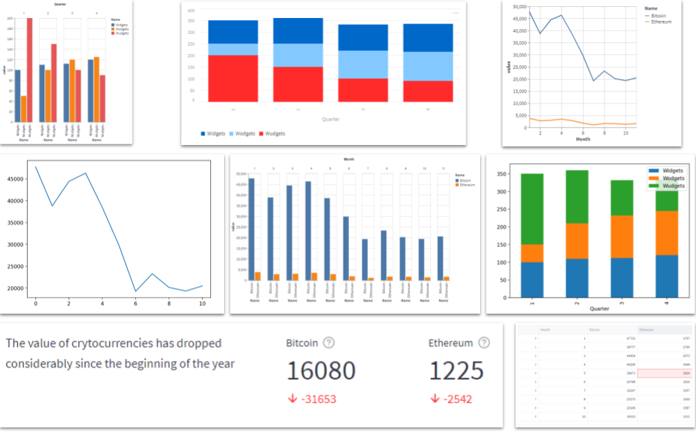
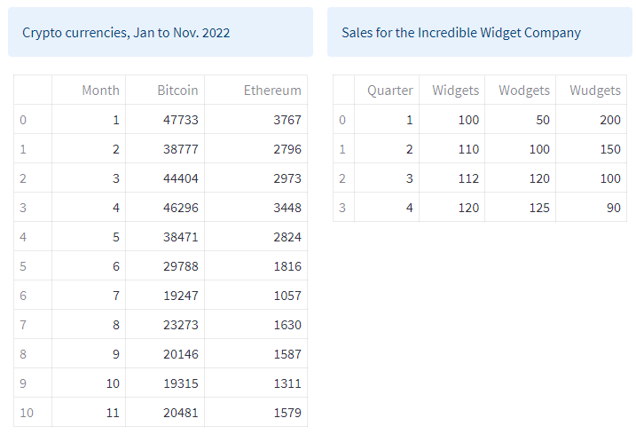

# Presenting Data

From text and tables to sophistcated charts. From Pandas dataframes, to Matplotlib, Plotly, Altair and other charts. Streamlit provides a comprehensive set of tools for presenting your data



Streamlit was designed for Data Scientists and so data presentation is fundamental to it.

In previous sections, we've looked at how to get started with Streamlit and how to include various forms of text, images, video and audio in a Streamlit application. Now we get to the nitty gritty of how to represent the data that you have painstakingly discovered, processed and analysed.

Streamlit supports several charting packages, like Plotly, Altair and Bokeh, as well as ways of textually presenting data. We will look at them all.

We are going to explore these various packages, as well as the built-in methods of data visualization that Streamlit provides.

Don't forget that if you are coding along with this then before any code snippet you'll need to include:

```` Python
import streamlit as st
````

## Data

We are going to use two small data sets. The first is real cryptocurrency data for this year to date (Nov. 2022) and the second is some fictional sales data. 

There is no formal source for the crypto data, I just Googled the value in USD of Bitcoin and Ethereum for the first day of each month this year, so far (Jan to Nov, 2022) and I invented the sales data.

<!---->


To create this data, execute the following code.

```` Python
# Crypto monthly data
d = {'Month':[1,2,3,4,5,6,7,8,9,10,11],
     'Bitcoin':[47733,38777,44404,46296,38471,29788,19247,23273,20146,19315,20481],
     'Ethereum':[3767,2796,2973,3448,2824,1816,1057,1630,1587,1311,1579]}

cryptodf = pd.DataFrame(data = d)

# The Incredible Widget Company
d = {'Quarter':[1,2,3,4],
     'Widgets':[100,110,112,120],
     'Wodgets':[50,100,120, 125],
     'Wudgets':[200,150,100,90]}
     
salesdf = pd.DataFrame(d)
````
Next we'll see how we can present this data in textual form and, later, as charts using the built-in Streamlit charts and the libraries Altair, Bokeh, Vega-lite and Plotly.
