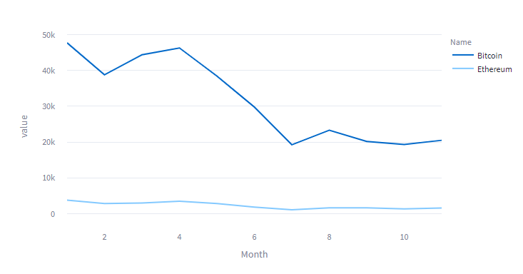
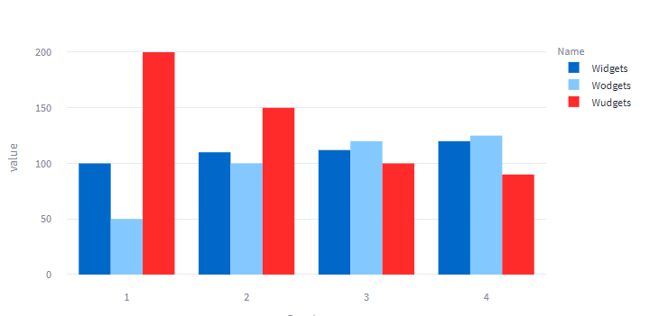

# Plotly

Plotly is one of the most popular plotting packages for Python and the web. It is arguably easier to use than Altair and better looking than Pyplot — although there are some restrictions on its use in Streamlit. Plotly charts are also interactive. Hovering over them shows you the data points and you can also pan and zoom in on a plot.


We will use the package recommended by Plotly, Plotly Express, and to use it we import it like this.

```` Python
import plotly.express as px
````

Here is the simple line chart that we have seen before plotting the values of ETH and BTC plotted with Plotly Express.



The code is pretty simple. Using px.line() to draw a line graph, we specify the data, the x- and y-axes and a data column to use to colour the lines that we plot.

```` Python
c = px.line(cryptodf1, x="Month", y="value",
             color='Name', 
             height=400)

st.plotly_chart(c)
````

I have additionally set the height of the figure.

Bar charts are as easy. Here is a grouped bar chart of our sales data.



And this is the code.

```` Python
c = px.bar(salesdf1, x="Quarter", y="value",
             color='Name', barmode='group',
             height=400)

st.plotly_chart(c)
````

We are employing ``px.bar()`` to draw the chart but apart from that the only difference between this and the line chart is that can you specify the barmode which is either group or stack.

Plotly is one of the simplest packages to get started with but there are restrictions when used with Streamlit. Streamlit imposes its own theme that overrides the default Plotly one. You can revert to the Plotly theme like this:

```` Python
st.plotly_chart(c, theme=None)
````

The argument ``theme`` can take one of two values, ``Streamlit`` or ``None``, which give you the Streamlit theme and the default Plotly theme, respectively.

Personally, I don't much like the default Plotly theme, so the (relatively new) Streamlit one is quite welcome but it is a shame that other themes cannot be used - there is a way around this, however and I shall add an update in the near future to address this omission.

