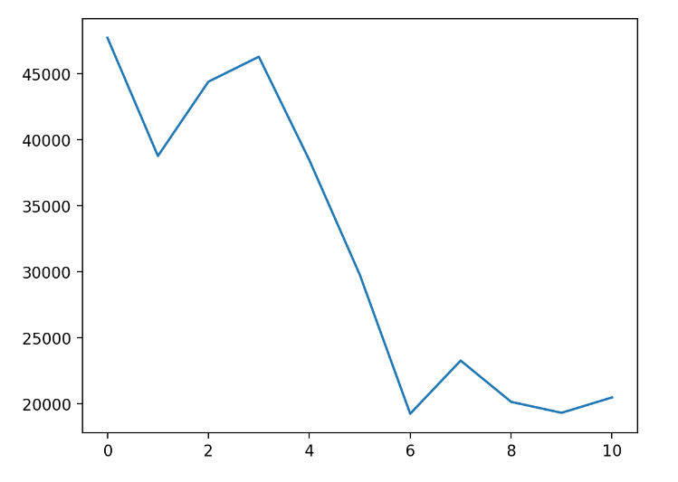
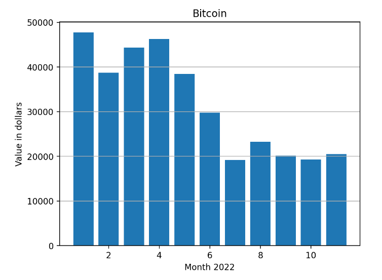
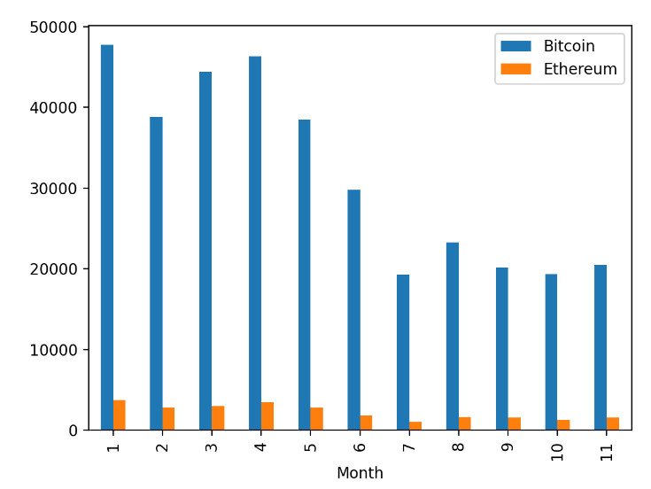

# Pyplot

The first supported charting package we will look at is _Pyplot_ - essentially this is support for the Python Matplotlib package but we can also use the Pandas plotting methods as they are built on the Matplotlib package.

Here is a the code for a line plot of the crypto data.

```` Python
fig, ax = plt.subplots()
plt.plot(df['Bitcoin'])
st.pyplot(fig)
````

The first line of the code initializes the figure, ``fig``, and axis, ``ax``, variables. In this example ``ax`` is not used but we must initialize ``fig`` so that we can pass it to the ``st.plot()``.

This is the resuting chart.

<!---->


It's pretty basic but we can customize it with some additional commands. Here we add labels to the axes, a title and draw y-axis grid lines on a bar chart.

```` Python
# Pyplot charts are customizable
fig, ax = plt.subplots()
plt.bar(df.Month, df.Bitcoin)
ax.set_ylabel("Value in dollars")
ax.set_xlabel("Month 2022")
ax.set_title("Bitcoin")
plt.grid(axis='y')
st.pyplot(fig)
````

<!---->



This is better. Matplotlib charts are highly cutomizable but to get them exactly how you want them, you could end up writing quite a lot of code.

A compromise is to use the plotting methods from Pandas which will provide a slightly more sophisticated chart with the minimum of coding.

<!---->



```` Python
fig, ax = plt.subplots()
df.plot.bar(x = 'Month', y=['Bitcoin','Ethereum'],ax=ax)
st.pyplot(fig)
````

Notice that here we can easily plot both BTC and ETH by specifiying them in a list. It is also important to note that we need to pass ``ax`` to the plot function call - in this way the new plot is added to the figure.(If you don’t do this, you’ll end up with an empty chart!)

