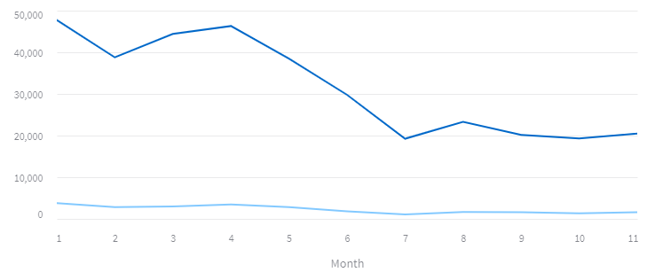
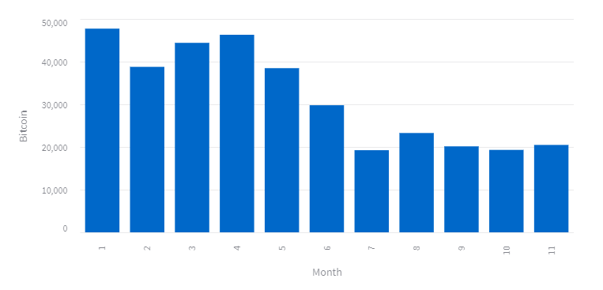
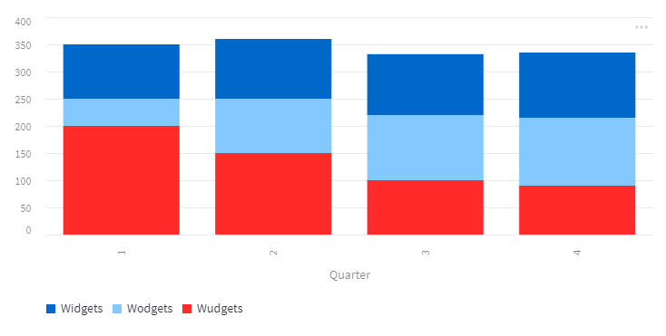
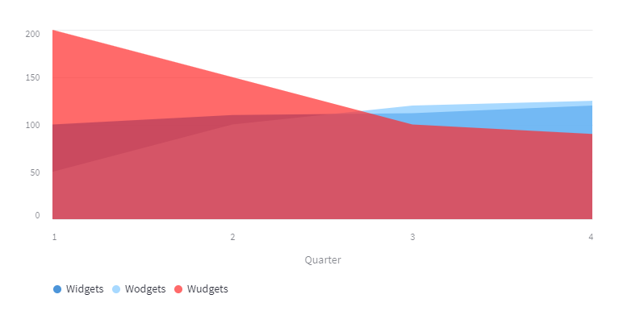

# Streamlit charts

Streamlit supports several charting packages and also has three built-in charts that are essentially wrappers around their  _Altair_ equivalents.

The built-in charts are ``st.line_chart()``, ``st.bar_chart()`` and ``st.area_chart()``. They are attractive and easy to use but not very flexible.

Here is a line chart that shows the decline of Bitcoin and Ethereum over most of 2022.

<!---->


And here is the code that produced it. 

```` Python
st.line_chart(df, x='Month')
````

The built-in charts require a data source, ``df`` and a data column to use as the x-axis. If the y-axis is left undefined then all of the remaining columns will be plotted. Otherwise, the y-axis should be a single column name, or a list of column names.

Here is a bar chart of the just the Bitcoin data.

<!---->



```` Python
st.bar_chart(df, y = 'Bitcoin', x='Month')
````

I have only plotted one column, here, because the default behaviour of this chart is to plot a stacked bar chart which means that we are adding one or more sets of values in order to construct the bar. 

This would be entirely suitable for a sales chart where individual items can be accumulated to form a total. Like this one that tracks the sales of items manufactured by the _The Incredible Widget Company_ over a year. Their flagship product is the _Widget_ but they have two other products, the _Wodget_ and the _Wudget_ and we can see how well they are selling, below.

<!---->


From this chart we can see that overall sales are not improving despite the apparent popularity of _Wodgets_. Sales of _Widgets_, their staple product, are holding up but the decline in the sales of _Wudgets_ is letting the company down.

Here is the code to produce that chart.

````Python
st.bar_chart(salesdf, x='Quarter')
````
Notice that the y-axis is not defined, so all remaining columns are plotted.

The last built-in chart is the area chart. Here are the sales data again.

<!---->


````Python
st.area_chart(salesdf, x='Quarter')
````
Here you can see the relative performance of the sales lines, although in the area chart they not additive, so we do not easily get a view of the overall sales performance.

I have to say, I am not a great fan of this default colour scheme and there doesn’t seem to be any obvious way of changing it.
