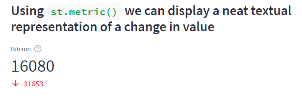
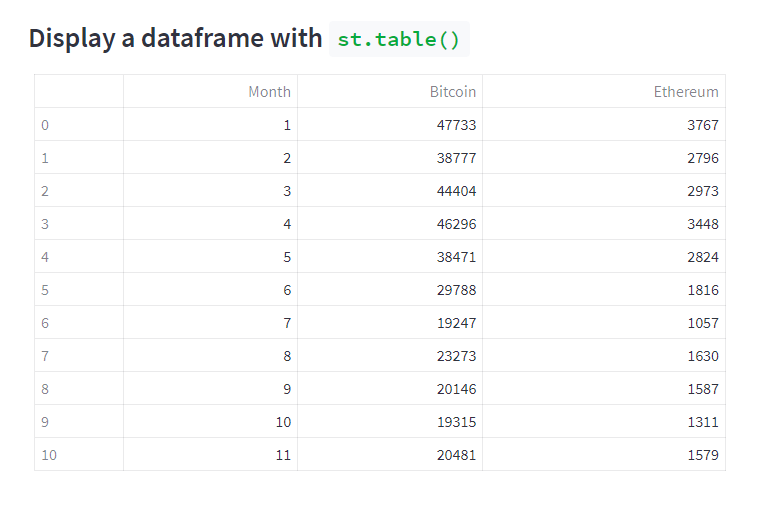
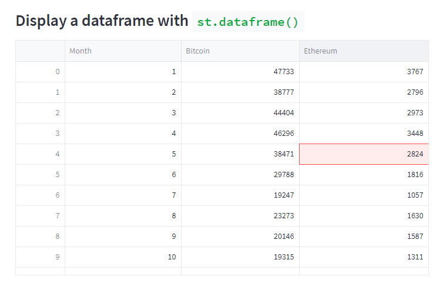

# Presenting data with text

We will get to Streamlit's charting capabilities shortly but presenting data is not always about charts. Sometimes a simple textual presentation or a table is a perfectly adequate way of getting your message across. 

Streamlit provides a neat way of presenting a simple change in a value, ``st.metric()``. It looks like this:

<!---->



It is very easy to construct. The code below uses ``st.metric()`` to diplay the change in value of Bitcoin (BTC) since the beginning of this year. I start by defining 3 variables, ``btcCurrent``, the value of BTC at the time of writing, ``btcYrBeg``, the value at the beginning of the year, and ``btcDelta``, the change from then until now.

```` Python
btcCurrent = 16080
btcYrBeg = 47733
btcdelta = btcCurrent - btcYrBeg

st.metric("Bitcoin", btcCurrent, delta=btcdelta, delta_color="normal", 
          help="Change in Bitcoin dollar value since the year beginning")
````

There are four parameters: the first is a title; the second, is the current value that will be the large, displayed number; the third is the change in value, which will be displayed in red (decrease in value) or green (increase in value); the fourth parameter allows us to change the colour coding of the delta value and takes the value "normal" (the default), "inverse" (swap red and green), or "off" (grey); lastly is an option tooltip.

I've done much the same thing with Ethereum (ETH) and then combined the two _metrics_ with some text into three columns to provide a simple but effective presentation. Here is the code requred for Ethereum.

```` Python
ethCurrent = 1225
ethYrBeg = 3767
ethdelta = ethCurrent - ethYrBeg
````


Here is the code to display the data in columns:

```` Python
# Use columns to display them together
col1, col2, col3 = st.columns([50,25,25])
col1.write("The value of crytocurrencies has dropped considerably since the beginning of the year")
col2.metric("Bitcoin", btcCurrent, delta=btcdelta, delta_color="normal", 
            help="Change in Bitcoin dollar value since the year beginning")
col3.metric("Ethereum", ethCurrent, delta=ethdelta, delta_color="normal", 
            help="Change in Ethereum dollar value since the year beginning")
````
The result looks like this:


We have briefly touched on columns in previous articles. Here we create three columns and weight them according to the values in the list passed to the ``st.columns()`` method. Thus ``col2`` and ``col3`` are the same widths and ``col1`` is twice as wide as the other two. We write in those columns by preceding the method call with the column name instead of ``st``.


## Tables and dataframes

In Streamlit you can also display data as a _table_ or a _dataframe_. 

Tables might seem a bit boring but they are easily interpreted by readers as they are so ubiquitous. Run your finger down the rows until you find the one you are interested in and then run it across until you find the correct column and there is the figure you are looking for!

On the face of it there doesn't seem to be much difference between the two methods; they both display a table. However ``st.dataframe()`` is more flexible. 

Both can take a Pandas dataframe as the source of the data but ``st.table()`` has no other options, it simple displays the data in a table that fits the page (or container). ``st.dataframe()`` is more flexible, you can specify the height and width, or fill the width of the container and if the dataframe is too large it will be scrollable. ``st.dataframe()`` is also interactive - click on a cell and it will be highlighted; click on a column and the data will be ordered by that column.

Here is a table that displays a monthly view of BTC and ETH prices.

````Python
st.table(cryptodf)
````

<!---->

_Data source: Google_


And here is the dataframe version that has a user highlighted cell.

````Python
st.dataframe(cryptodf, use_container_width=True)
````

<!---->



_Data source: Google_

I've kept the dataframe the same width as the table by setting the ``use_container_width`` parameter to ``True``.

Tables provide easy access to data if you know what you are looking for. But it is not particulary easy to detect trends or correlations.

For that you need charts.
