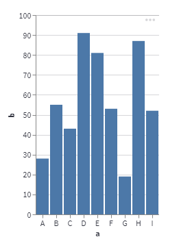

# Vega-lite

Vega-Lite is a platform-neutral grammar of graphics specification for interactive visualizations.

A Vega-Lite graphic is specified as a JSON structure, like this one from the Vega-Lite examples web page.

````
{
  "$schema": "https://vega.github.io/schema/vega-lite/v5.json",
  "description": "A simple bar chart with embedded data.",
  "data": {
    "values": [
      {"a": "A", "b": 28}, {"a": "B", "b": 55}, {"a": "C", "b": 43},
      {"a": "D", "b": 91}, {"a": "E", "b": 81}, {"a": "F", "b": 53},
      {"a": "G", "b": 19}, {"a": "H", "b": 87}, {"a": "I", "b": 52}
    ]
  },
  "mark": "bar",
  "encoding": {
    "x": {"field": "a", "type": "nominal", "axis": {"labelAngle": 0}},
    "y": {"field": "b", "type": "quantitative"}
  }
}
````
_Listing courtesy of the Vega-Lite examples web page_

This also is a valid declaration for a Python list, so we can assign it to a variable and plot it like this.

```` Python
st.vega_lite_chart(c)
````



To my mind, this is a rather long-winded way of creating a graphic and because Altair is an implementation of Vega-Lite in Python, and thus a more attractive proposition for a Python programmer, we will leave this particular feature of Streamlit at that.

For more information on the Vega-Lite specification, refer to the (Vega-Lite website)[http://vega.github.io/vega-lite/].
