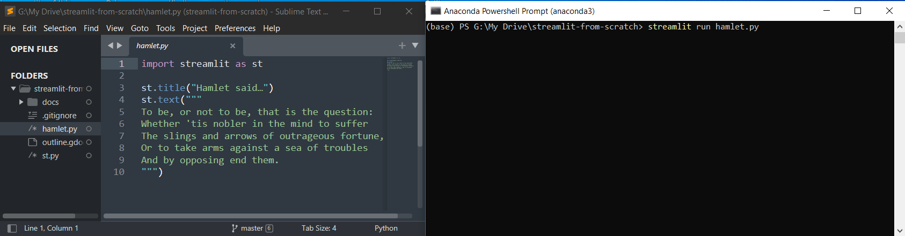
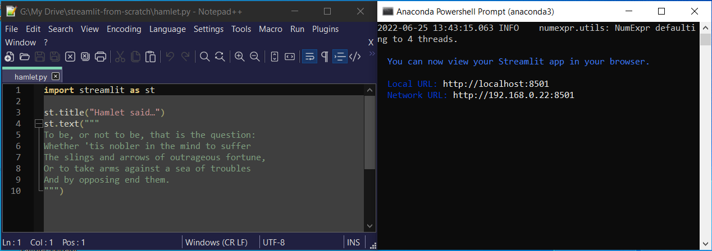
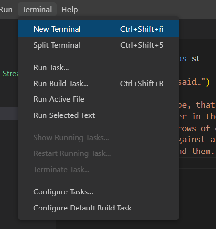
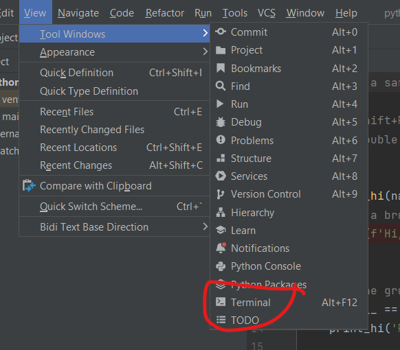

## Editors

Almost any editor is suitable for writing Streamlit apps. If you are already a Python programmer then you will already have your favourite - maybe one of the IDEs, VSCode or PyCharm - but a simple general-purpose editor such as __Sublime Text__ or __Notepad++__ is perfectly adequate, too.

When we run normal Python programs we issue the following command:

```` bash
# This won't work with Streamlit
python myprogram.py 	
````

And IDEs such as VSCode and PyCharm assume this when running Python programs. However, the command we need to run a Streamlit app is:

```` bash
# This how to run a Streamlit app
streamlit run myprogram.py
````

The consequence of this is that the standard 'Run' command in VSCode or PyCharm doesn't work for Streamlit apps. 

The easiest way around this is to type the correct command in a command window. This can be external to the editor, like the Anaconda prompt, or the built-in terminal window in your operating system (if you are not using Anaconda). 

If you use a simple editor such as Sublime Text or Notepad++ this is the best approach. You can modify both of these editors to add a terminal window (Sublime) or add a commad to run your app (Notepad++) but the simplest method is to use the Anaconda Prompt (or Anaconda Powershell Prompt) window, if you have installed Anaconda, or the standard terminal window for your operating system, if you've installed Python from Python.org.

Here are screenshots of the Sublime Text and Notepad++ editors side-by-side with an Anaconda Powershell prompt.

<!---->

<!---->
Sublime Text:



Notepad++:



If you are a seasoned Python programmer, already have your favourite version of Python installed and use VSCode or PyCharm, you can use a terminal window within the your IDE. In VSCode there is a Terminal menu option where you can open a new terminal

<!---->



 and in PyCharm, go to the Views menu and find the Terminal option in Tool Windows.

<!---->



So, to run your program from one of these IDEs type the run command into the terminal window.

_**Note...** If you have installed Anaconda, start VSCode from Anaconda Navigator or from the Anaconda prompt - this will ensure that you are using the correct version of Python. When using Pycharm with Anaconda it may not pick up the correct version of Python in the terminal window and so it be necessary to use an external terminal._ 

## Which editor should you use

VSCode and Pycharm are quite sophisticated IDEs. VSCode is a general-purpose tool that can be customized with plugins to support many different languages. PyCharm is dedicated to Python programming.

Sublime Text is simple to use, quick to download and install but not free: you can download a free trial version but are expected to pay for a license. Having said that, the trial never expires.

The Notepad++ user interface is, perhaps a little busier than Sublime but it is also a perfectly capable editor and is entirely free.

Both Sublime and Notepad++ support colour highlighting of Python code, which is nice. So too, of course, do VSCode and PyCharm.

If you are already a VSCode or PyCharm user then you will probably want to carry on using them but if you don't already use one of these, then Sublime Text or Notepad++ are probably easier to start with.

There is one more tool that we need to run a Streamlit app and that is a browser such as Chrome, Firefox or Edge. But I assume that you have one of these already.

So, now we have all the tools, we are ready to create our first Streamlit app.

