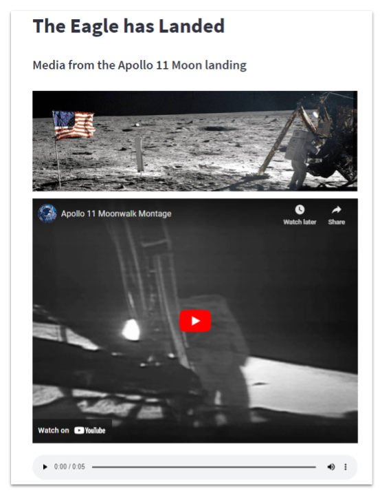
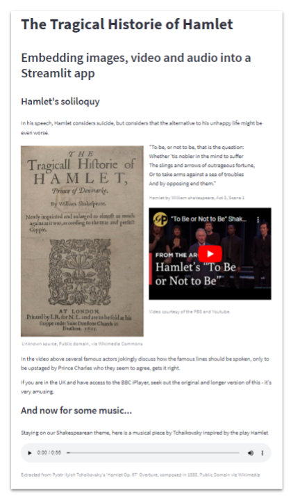

# Embedding images, video and audio into a Streamlit app

 Streamlit was designed to help data scientists but while our data may be the focus of our app, the addition of media - images, video and audio -  can help to communicate your ideas. Below is a famous image of the first moonwalk - the first time a human has set foot on the surface of an extraterrestrial body.

<!---->


_Public domain image, courtesy of NASA_

In the first part of this series, _Getting Started_, we saw how to set up the Streamlit development environment and how easy it is to create a simple web app using different types of text.

This time we will look at how we can enhance our app with different media - images, video and sound. We'll also learn a little bit about how to layout a Streamlit app.

We'll create two different apps. The first moves us forward a few centuries from our original Shakespeare theme to the Moon landing of 1969; it is a simple compilation of an image, a video and an audio file with a little text. The app simply positions each element one above the other.

The second app reverts back to the Shakespeare theme and also combines image, video and audio but with a, slightly more column layout.


## App 1: The Eagle has landed
<!---->


_A screenshot of 'The Eagle has Landed' app_

On the morning of July 16, 1969, Apollo 11 astronauts Neil Armstrong, Buzz Aldrin and Michael Collins were about to be launched into space from the Kennedy Space Center. Their mission was to lead to one of the most famous events in history: the first Moon landing.

Here we are going to see how various media files from that mission can be incorporated into a Streamlit app.

Streamlit provides the functions ``st.image()`` to include graphics, ``st.video()`` for videos, including local or Youtube videos, and ``st.audio()`` for audio and they all support media in various formats.

The image we will use shows Apollo 11 Commander Neil Armstrong working at an equipment storage area on the lunar module during the moonwalk.

<!---->


_Public domain image courtesy of NASA_


You include it in your Streamlit app like this:

```` Python
    st.image('./images/464487main_AS11-40-5886_full.jpg',
        caption = "Public domain image, courtesy of NASA")
````

The video is of the Moon walks and is very poor quality by today's standards. But given that it was originally taken in 1969 (and on the Moon!) that is hardly surprising. Here is a link to the video on Youtube.

<!---->
<iframe width="560" height="315" src="https://www.youtube.com/embed/hxPbnFc7iU8" title="YouTube video player" frameborder="0" allow="accelerometer; autoplay; clipboard-write; encrypted-media; gyroscope; picture-in-picture; web-share" allowfullscreen></iframe>

_Footage from the Apollo 11 moonwalk that was partially restored in 2009, public domain, courtesy of NASA and Youtube_

We include it in a Streamlit app like this:

```` Python
    st.video('https://youtu.be/hxPbnFc7iU8')
````

Lastly, the audio is the famous "The Eagle has landed" message from Armstrong to the Houston mission base.

<audio controls>
  <source src="./audio/590333main_ringtone_eagleHasLanded_extended.mp3" type="audio/mp3">
Your browser does not support the audio element.
</audio>

_Public domain media sourced from NASA's Soundcloud channel._

The source file is shown in the ``st.audio()`` statement below.

```` Python
st.audio("https://www.nasa.gov/mp3/569462main_eagle_has_landed.mp3")
````

The entire code for the whole program is only half a dozen lines and produces the app shown above.

Here is the full code - try it out:

```` Python
import streamlit as st

st.title('The Eagle has Landed')
st.header('Media from the Apollo 11 Moon landing')

st.image('https://www.nasa.gov/sites/default/files/styles/ubernode_alt_horiz/public/images/464487main_AS11-40-5886_full.jpg')
st.video('https://youtu.be/hxPbnFc7iU8')
st.audio("https://www.nasa.gov/mp3/569462main_eagle_has_landed.mp3")
````

_Listing: eagle.py_

## App 2: "THE Tragicall Hiftorie of HAMLET"

<!---->


Last time we left Shakespeare's tragic hero, Hamlet, he was contemplating whether or not to end his life in his famous soliloquy. We are going to expand that app with some additional material - an image, a video and an audio track - and lay it out in two columns.

The image that we will use is from Wikimedia and is a flyer for a performance of the play in Shakespeare's time.

<!---->


_Unknown source, Public domain, via Wikimedia Commons_

You include it in your Streamlit app like this:
```` Python
    st.image('./images/hamletflyer.png', 
        use_column_width=True,
        caption = "Unknown source, Public domain, via Wikimedia Commons")
````

The video is a comical sketch with a number of very well-known actors who try, in turn, to explain how the famous 'To be, or not to be...' lines should be spoken. Finally, and unexpectedly, they are upstaged by HRH Prince Charles (as he was, then) who, they seem to agree, gets it right.

Here is the clip:

<iframe width="560" height="315" src="https://www.youtube.com/embed/sw_zDsAeqrI" title="YouTube video player" frameborder="0" allow="accelerometer; autoplay; clipboard-write; encrypted-media; gyroscope; picture-in-picture; web-share" allowfullscreen></iframe>

<!---->

_Video courtesy of the PBS and Youtube._

And here is the code:

```` Python
    st.video('https://youtu.be/sw_zDsAeqrI')
````

_(If you are in the UK and have access to the BBC iPlayer, seek out the original and longer version of this - it's worth watching.)_

Lastly, the audio is a musical piece by Tchaikovsky inspired by the play Hamlet. You can play the piece from the control below.

<audio controls>
  <source src="https://upload.wikimedia.org/wikipedia/commons/3/3b/Tchaikovsky-Hamlet_Op67_vs_Kosma-FeuillesMortes.ogg
" type="audio/ogg">
Your browser does not support the audio element.
</audio>

_Extracted from Pyotr Ilyich Tchaikovsky's 'Hamlet Op. 67' Overture, composed in 1888. Public Domain via Wikimedia_

And the code to include it in your program is this:

```` Python
st.audio("https://upload.wikimedia.org/wikipedia/commons/3/3b/Tchaikovsky-Hamlet_Op67_vs_Kosma-FeuillesMortes.ogg")
````

The complete code is rather longer than the first app as there is more text and we use a column layout.

We create two columns with line

````Python
col1, col2 =  st.columns(2)
````
The call to ``st.columns`` returns a list of columns that we assign to two variables ``col1`` and ``col2``. We use the columns in a ``with`` statement - all of the code within the ``with col1:``, for example, will be displayed in a column to the left of the screen. 

In the code below, you can see that we first display a title and some other text. This is followed by the code for the first column which contains the image, and then the second column which contains the text of Hamlet's soliloquy and a video.

Following the code for the columns, we have more text which is followed by the audio file.

Here is the complete code:

````Python
import streamlit as st
import pandas as pd

st.title('The Tragical Historie of Hamlet')
st.header('Embedding images, video and audio into a Streamlit app')

st.subheader("Hamlet's soliloquy")
st.write("""In his speech, Hamlet considers suicide, but considers that the 
            alternative to his unhappy life might be even worse.""")

col1, col2 =  st.columns(2)

with col1:
    st.image('https://upload.wikimedia.org/wikipedia/commons/d/df/Hamlet.jpg', use_column_width=True,
          caption = "Unknown source, Public domain, via Wikimedia Commons")

with col2: 
    st.markdown("""
    "To be, or not to be, that is the question:<br/>
    Whether 'tis nobler in the mind to suffer<br/>
    The slings and arrows of outrageous fortune,<br/>
    Or to take arms against a sea of troubles<br/>
    And by opposing end them."
    """, unsafe_allow_html=True)
    st.caption("Hamlet by William shakespeare, Act 3, Scene 1")

    st.video('https://youtu.be/sw_zDsAeqrI')
    st.caption("Video courtesy of the PBS and Youtube.")

st.write("""In the video above several famous actors jokingly discuss
         how the famous lines should be spoken, only to 
         be upstaged by Prince Charles who they seem to agree, 
         gets it right.""")

 
st.write("""If you are in the UK and have access to the BBC iPlayer,
            seek out the original and longer version of this - it's very amusing.""")

st.subheader("And now for some music...")

st.write("Staying on our Shakespearean theme,         here is a musical piece by Tchaikovsky inspired by the play Hamlet")
st.audio("https://upload.wikimedia.org/wikipedia/commons/3/3b/Tchaikovsky-Hamlet_Op67_vs_Kosma-FeuillesMortes.ogg")

st.caption("Extracted from Pyotr Ilyich Tchaikovsky's 'Hamlet Op. 67' Overture, composed in 1888. Public Domain via Wikimedia")
````

_Listing: hamlet4.py_

Next we will look at how we can use Streamlit layout capabilities to produce an app that incorporates several elements in an efficient and pleasing way. Later we will explore various ways of representing data in a Streamlit app, from data tables to visualizations using charts.

Click on _Next_ to continue.
