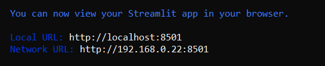
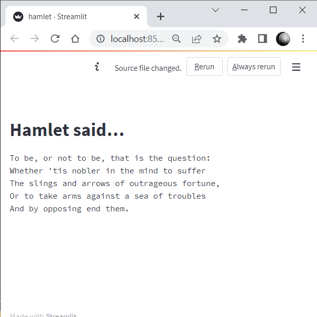
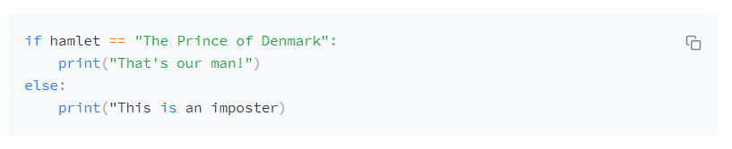
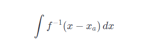
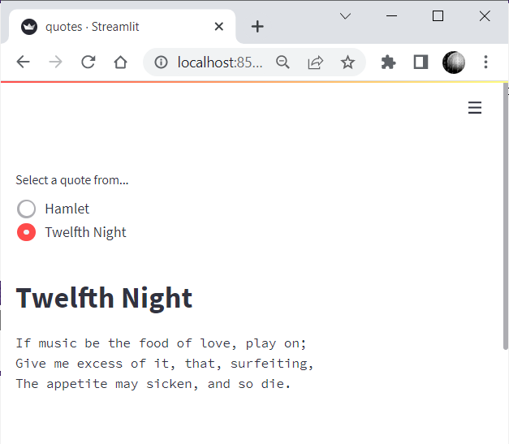

## 'Hello Hamlet'

In this section we are going to write our first program and look at the various ways of displaying text in a Streamlit app, including, plain text, headers, Latex and Markdown.

'Hello World' has been the traditional first program that anyone writes in any language for decades - it just displays 'Hello World' on the screen. The first time I came across it was in the book "The C Programming Language" by Brian W. Kernighan and Dennis M. Ritchie whose first edition came out in 1978 (although, admittedly, my copy was the second edition that was published 10 years later).

We've already seen our first program: it's Hamlet. But it is pretty much the equivalent of 'Hello World' as it just writes some text.

I'll repeat it here so we can run through an explanation of how it works.

```` Python
import streamlit as st

st.title("Hamlet said…")
st.text("""
To be, or not to be, that is the question:
Whether 'tis nobler in the mind to suffer
The slings and arrows of outrageous fortune,
Or to take arms against a sea of troubles
And by opposing end them.
""")
````

_Listing 1 - hamlet.py_

This is one of the simplest Streamlit programs you can imagine. It just writes two strings - one formatted as a title and the other as pre-formatted text.

The first line will be very familiar to any Python programmer; it imports a Python library - the Streamlit library. As you may well know a Python library is a package of code that contains useful functions that can be incorporated into a Python program. In this case, the Streamlit library incorporates all of the functionality that turns a simple Python program into a web app and provides us with a large number of functions that allows us to build that web app and make it look good.

The Streamlit library is imported with the name ``st`` so that all of the functions that we use from that library are preceded with that name.

There are two Streamlit functions that we use: ``st.title()`` which formats text in a large bold font and ``st.text()`` which displays pre-formatted text.

For those unfamiliar with Python, there are four ways of quoting a string. We can use single or  double quotes like this ``'To be or not to be...'``, or ``"To be or not to be..."`` but these strings must be all on one line. Alternatively, we can use triple quotes like this:

```` Python
'''To be or not to be,
   that is the question'''
````
or

```` Python
"""To be or not to be,
   that is the question"""
````

The triple quoted strings can run over more than one line.

To run the program, type in the text exactly as you see it above and then, in a terminal, run

````
streamlit run hamlet.py
````

The terminal will respond with a message similar to this:

<!---->




Your default browser will then be started with the web page that has been generated by Streamlit. (If for some reason it does not start automatically then simply cut and paste the URL given in the terminal window into the address bar of your browser.)

One of the nice things about Streamlit is that it knows when you have made a change to the code. If you edit and save your program, then the web page will display the option to re-run the app. When you do so the new version is displayed.

Try changing the text in your editor and then save it. Go to your browser and you will see that you are invited to re-run the app.

<!---->


Click on the _Rerun_ button and you will see an updated web page that reflects the changes that you made.

## More ways of displaying text

We have used ``st.text()`` to display Hamlet's speech but there are other ways of displaying text, too. Here is an expanded version of the Hamlet program.

It uses ``st.caption()`` to display a small-font caption under the quote and then uses ``st.header()``, ``st.subheader`` and ``st.write`` to display some comments about the quote.

I'm certain that you can guess what these will do. A header has a large bold font, but smaller than a title; a subheader is similar but smaller, again; and ``st.write`` displays 'normal' text.

One thing that you should note is that unlike ``st.text()``, ``st.write()`` does not preserve the layout of the text in a string, so any new lines that you have inserted in a triple-quoted string will be converted to spaces and lines of text will fill the width of the viewport.

````Python
import streamlit as st

st.title("Hamlet")

st.text("""
To be, or not to be, that is the question:
Whether 'tis nobler in the mind to suffer
The slings and arrows of outrageous fortune,
Or to take arms against a sea of troubles
And by opposing end them.
""")

st.caption("Hamlet by William Shakespeare, Act 3, Scene 1")

st.header("Hamlet's soliloquy")
st.subheader("The famous speech from the 'Nunnery scene'")
st.write("""In the speech, Hamlet considers suicide, but considers that the 
            alternative to his unhappy life might be even worse.""")
````
_Listing 2 - hamlet2.py_

You can see the result in the screenshot, below.

<!---->


For completeness, we should also mention two other ways of displaying text.

For programmers there is ``st.code()``. This will display text as if it were program code. For example:

```` Python
st.code("""
if hamlet == "The Prince of Denmark":
    print("That's our man!")
else:
    print("This is an imposter")
""")
````
<!---->


You can see that certain words like ``if`` and ``else`` are highlighted as keywords. The block has a coloured background and, if you position your cursor over the block, you will see an icon for copying the text.

If you need to display Latex strings such as mathematical formulae then you can use ``st.latex()``, e.g.

````Python
st.latex(" \int f^{-1}(x-x_a)\,dx")
````

displays the following:

<!---->



## Markdown

Markdown gives us more control over the way our text is formatted. You may be familiar with it. As Wikipedia states, "Markdown is a lightweight markup language for creating formatted text using a plain-text editor". It allows you to define headers, code blocks, incorporate links and much else. It also let's you incorporate HTML.

The Streamlit code to incorporate Markdown text in an app is, unsurprisingly ``st.markdown()``. Here is an example:

```` Python
st.markdown("""## This is a sub-header
               And this is normal text. 
               *This is emphasized*.
               """)
````
And it will render like this:
    
## &nbsp;&nbsp;&nbsp;&nbsp; This is a sub-header

&nbsp; &nbsp; &nbsp; &nbsp; This is normal text. 
*This is emphasized*.


I'm not going to go into the details of the Markdown language as there is a good comprehensive guide [here](https://www.markdownguide.org/).

The Markdown definition allows for embedded HTML - this gives you more flexibility in you layout and style. However, Streamlit does not allow HTML to be embedded in Markdown by default. You need to set a parameter to allow it, e.g.

````Python
st.markdown("<h3>Header 3</h3>", unsafe_allow_html=True)
````

The idea of the parameter is to emphasize to the programmer that including HTML code could potentially be insecure.

This means we can replace ``st.text()`` with ``st.markdown()`` that incorporates HTML in order to set the line breaks where we want them but uses a normal font.
```` Python
st.markdown("""
    "To be, or not to be, that is the question:<br/>
    Whether 'tis nobler in the mind to suffer<br/>
    The slings and arrows of outrageous fortune,<br/>
    Or to take arms against a sea of troubles<br/>
    And by opposing end them."
    """, unsafe_allow_html=True)
````

The ``<br/>`` HTML tag inserts a line break and so gives us the same layout as before but using the standard font rather than the monotype font used by ``st.text()``:

"To be, or not to be, that is the question:<br/>
Whether 'tis nobler in the mind to suffer<br/>
The slings and arrows of outrageous fortune,<br/>
Or to take arms against a sea of troubles<br/>
And by opposing end them."


## A little interaction

Streamlit gives us many ways to interact with the user by using menus, buttons, sliders and more. We'll look at these in more detail later but to give you a flavour we'll write a simple program to select a piece of Shakespeare to display.

The code below uses the value of a set of radio buttons to decide which quote to display. If 'Twelfth Night' is selected the variable ``text`` is set to one quote, otherwise, if 'Hamlet' is selected ``text`` is set to a different quote.

The function ``st.radio()`` is used to select a value. Its parameters are a string that is used as a prompt followed by a list of string values that will be used to label the radio buttons. The function returns the value of the selection.

```` Python
import streamlit as st

quote = st.radio("Select a quote from...",('Hamlet', 'Twelfth Night'))

if quote == 'Twelfth Night':
    text = """
    If music be the food of love, play on;
    Give me excess of it, that, surfeiting,
    The appetite may sicken, and so die.
    """
elif quote == "Hamlet":
    text = """
    To be, or not to be, that is the question:
    Whether 'tis nobler in the mind to suffer
    The slings and arrows of outrageous fortune,
    Or to take arms against a sea of troubles
    And by opposing end them.
    """

st.title(quote)
st.text(text)
````
_Listing: quotes.py_

And this is what it looks like:

<!---->


When the user selects either 'Hamlet' or 'Twelfth Night' the entire program is re-run so that the if statement is executed and the appropriate quote is displayed.

This is an important aspect of Streamlit: whenever the user interacts with a program, it is run again from the beginning and the web page is reloaded.

---

In this first part, we've seen how to set ourselves up to edit and run a Streamlit app and how to write an app that displays different types of text. As a taste of things to come, we've also looked at some simple user interaction that allows the user to change the behaviour of the program.

In the next parts we will see more ways of interacting with the user, how to display images and graphs, how to design and lay out a Streamlit app using columns and containers and much more.

Next up is including media in a program.
